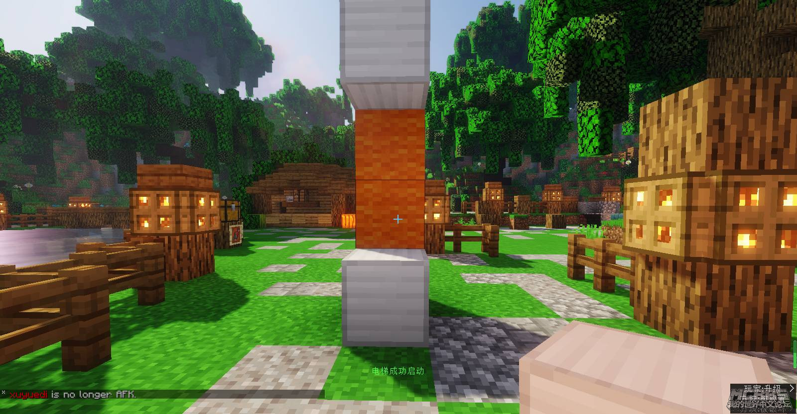

# 电梯
  

使用方法：拿着铁块，搭建电梯就像上面的图片一样。

# PVP切换

您可以使用/pvp 来切换您的PVP状态。

当你不处于PVP模式下，其他玩家将不会对您造成伤害。

# 不需要所有玩家睡觉来跳过黑夜

众所周知，大多数Minecraft玩家讨厌幻翼。

在疏林之森Air服务器里，只需要**40%**的玩家躺在床上，就可以安稳迅速地跳过夜晚。

# 砍树还会掉金苹果！

为了让更多人迅速建造属于自己的家，我们加入了砍树插件。

但实际上，砍树还能掉金苹果！

不信，你可以试试？